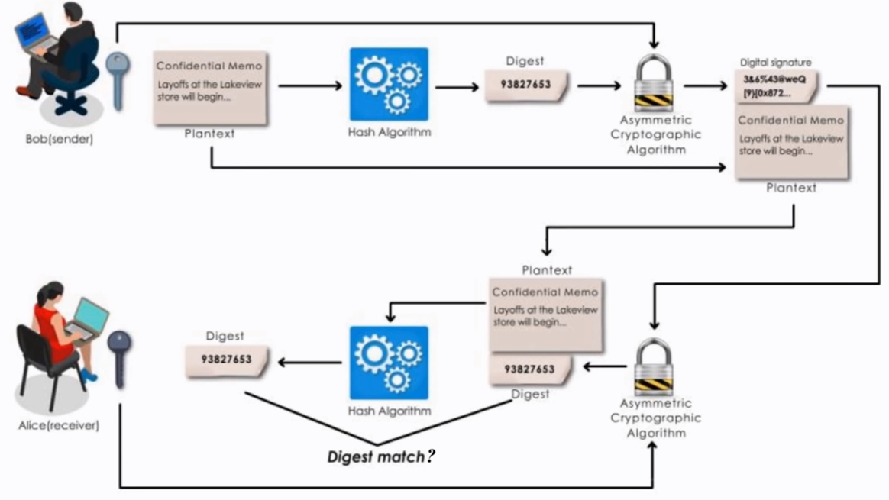
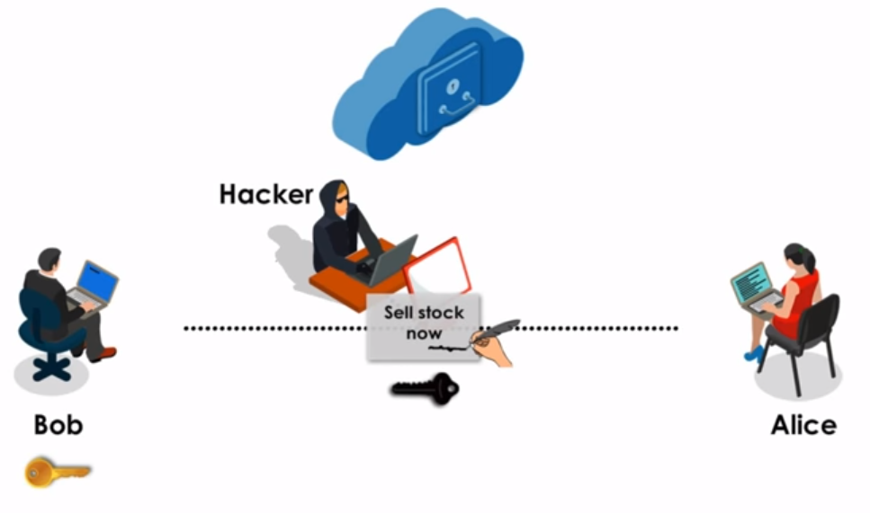
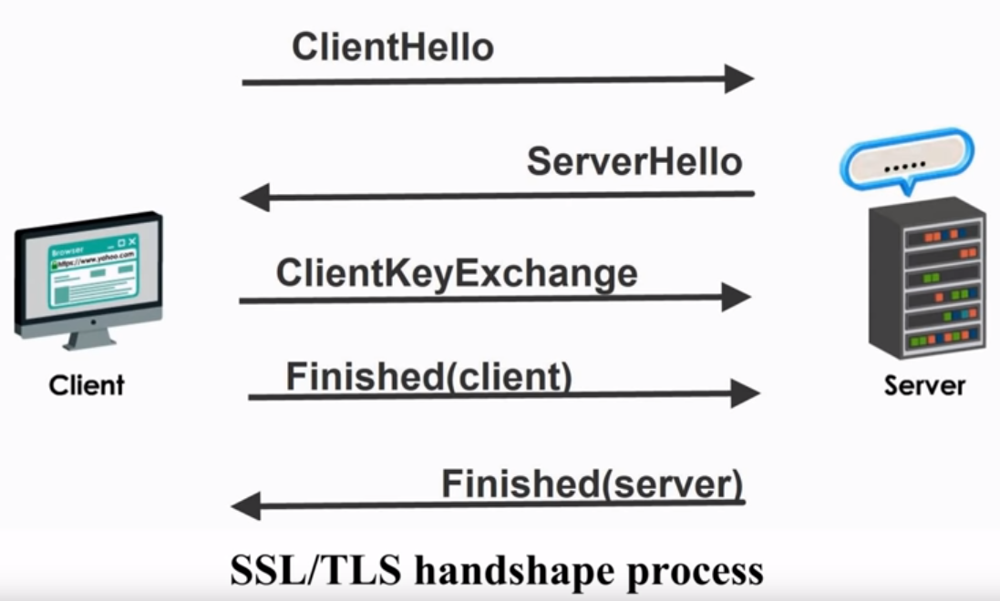
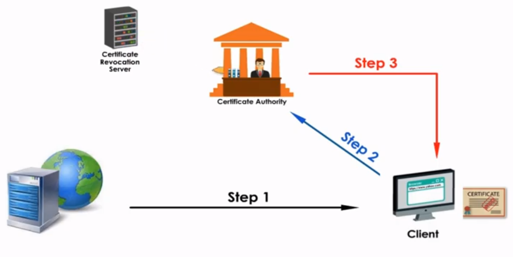
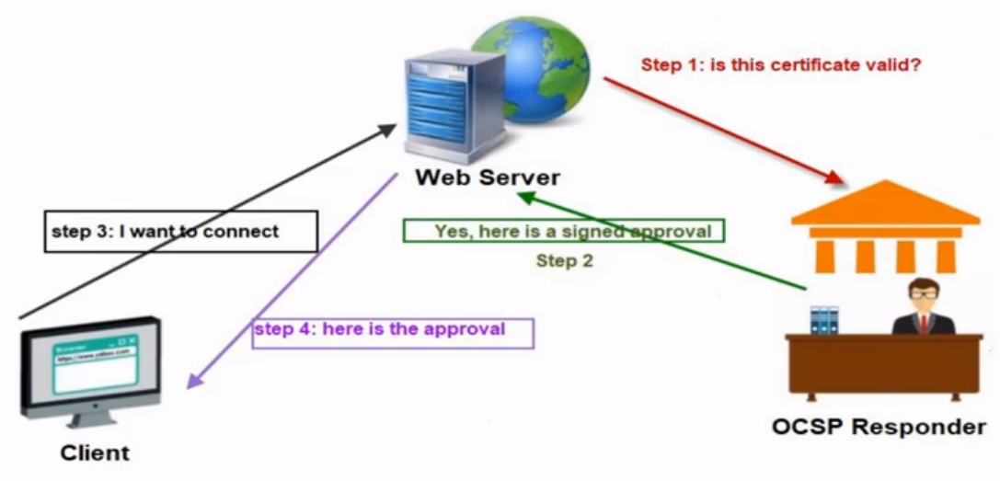

# Cryptography Basics

## Symmetric/Private Key Encryption 

Here the data is encrypted using a single key which is known by both the sender and receiver.  Since, both the reciever and sender have access to the same key, it is known as symmetric key encryption. 

:warning: Here data is encrypted and decrypted using the same key. 

### Methods of Symmetric Key Encryption

There are two methods which are used in symmetric key encryption - 

1.  **Stream Cipher**
1.  **Block Cipher**

#### Stream Cipher

The data is encrypted bit-by-bit in stream cipher. It is not much used in modern cryptography.

:warning: ```RC4``` (Rivest Cipher 4) is the most widely used stream cipher. 

#### Block Cipher

Here the data is encrypted in blocks of fixed size. The fixed size can be 64 bit, 128 bit or 256 bit long. 

The data is fed to the algorithm in chunks of fixed size. 

Some examples of Block Cipher are shown below - 

1.  ```DES``` (Data Encryption Standard)
1.  ```Triple DES```
1.  ```IDEA``` (International Data Encryption Algorithm)
1.  ```RC5``` (Rivest Cipher 5)
1.  ```AES``` (Advanced Encryption Standard)
1.  ```Blowfish``` etc. 

### Disadvantage of Symmetric Key Encryption

The symmetric key encryption is simple but it have a major disadvantage. In order for the receiving party to decrypt the message, the sender would somehow have to send the key along with the message. 

Ideally the key should be never shared with anyone. 

If this method of encryption were used in two-way communication and somehow the key lands in wrong hands, both sides of communication will be compromised. 

Public Key Encryption overcomes this disadvantage. 

## Asymmetric/Public Key Encryption 

Here two different keys are used to encrypt and decrypt data. The two keys that are used are as follows - 

1.  Public Key 
1.  Private Key

:warning: The two keys are mathematically related to each other. 

The public key is visible to everyone whereas the private key is present only with the user.

:boom: While using encrypting a message through public key encryption, we need to have access to the public key of the receiver. This is receiver oriented encryption method. 

Let's assume a scenario to better understand the situation. Let us suppose that **Person A** wants to send an encrypted message to **Person B**. In order for the person to do that, he has to have the public key of **Person B**. 

:warning: Public Keys are usually hosted on servers where everyone can access the public key. Here is an [example](https://pgp.mit.edu).

:warning: The public key is meant to be shared with everyone but **not** the private key.

### Credibility of the sender

The public key encryption is more secure than private key encryption but the credibility of the sender is not verifiable. 

To better understand this, let us assume another scenario where **Person A** wants to send a message to **Person B**. In order to do so, **Person A** will access the public key of **Person B** and then encrypt the message. However, since the public key of **Person B** is publicly visible, another entity say  **Person C** might also have access to it. 

Now the **Person C** can impersonate **Person A** and send a message to **Person B**. **Person B** in this case will receive a secure encrypted message but not from the original source. 

In order to avoid such a mishap, digital signatures are used to verfiy the authenticity of the sender. 

## Digital Signatures

Digital Signatures are important and they play a crucial role in verifying the sender. 

Here is an overview of how digital signatures work - 

<p align="center"></p>

The sender (in this case **Bob**) first generates a ```digest``` of the file by using a hash function. The ```digest``` is then encypted with the primary key of **Bob** to generate the **digital signature**. 

The original file can now also be encrypted using the public key of **Alice**. **Bob** now sends the encrypted file and the ```digest``` to **Alice**. 

When **Alice** receives the two files, she first decryptes the **digital signature** using **Bob's** public key. 

If **Alice** is able to decrypt the **digital signature**, she can conclude that the file is sent from the authentic sender (i.e. **Bob**). 

When **Alice** decryptes the **digital signature**, she gets the ```digest``` of the original file. 

**Alice** can now also decrypt the file sent by **Bob** by using her private key. 

:warning: In asymmetric key encryption, the data is encrypted using the pubilc key of the receiver. 

**Alice** will finally generate a ```digest``` of the decrypted file using a hash function. 

If the ```digest``` generated by **Alice** matches the one generated from the digital signature, we can say the file was not tampered during transit. 

:boom: No two files can have the same hash. It is unique for each file. There are different types of hashing algorithms. 

## Hashing 

Hash function or hash algorithm creates a **unique digital fingerprint** of data. This digital fingerprint is called **digest/hash/message digest**.

:radioactive: Hash is primarily used for comparision and not for encryption. 

### Characteristics of Hash Function 

1.  **Secure - Non-reversible function**

    Hash functions are not reversible. We cannot generate the original document from its digest. 

1.  **Fixed Size - Short or long data will produce the fixed-size digest**

    The digest produced by a hash function will be of fixed size irrespective of the size of the document. 

1.  **Unique**

    The digest of a document is unique and no other document can produce the same digest. Two different documents of a digest can never have the same digest. 

### Uses 

Hashing is commonly used for passwords. 

All passwords are hashed and then stored on servers and databases. When a user enters a password on a web site, a hash function converts the entered password to digest and then compares that digest to the one present on the server. If the two digest match, the user is authenticated. 

:warning: Passwords are always stored as hashes and never as plain text.

## Hacking Hashed Passwords

We know that hash functions cannot be reversed. So, the only way to break hashes is by making use of huge lookup tables. 

We can store the hashes of all the words in a huge look-up table and then perform a search operation for the target hash. Modern computers can easily perform this task really quick. 

## Dictionary Attack and Brute Force Attack

1.  **Dictionary Attack**

    In this attack, we read words from a source (such a wikipedia) and populate the data into a database. The hash for all the words in then generated. 

    The target word's hash is then searched in the dictionary. Once a match is made, the password is found. 

1.  **Brute Force Attack**

    This attack works well for small passwords. Here we go through all the possible combination of words and generate their hash. These hashes are then compared with the hash of the password that we want to break. 

    This method will only work well for passwords whose length is small.

## Kerberos

It is a client/server authentication protocol. 

Here we a client and who is trying to access a target server by using his password. In most systems the password is used to identify the user which is a bad thing as any user who has access to the password can take the original user's identity.

In order to prevent this from happening the user first sends the request to the a KDC **(Key Distribution Center)**. The KDC has a database and two more servers which are mentioned below -

1.  Authentication Server (AS)
1.  Ticket Granting Sever (TGS)

Sadly, I couldn't get time to read more on this. I'll update this later. :confounded:

## Salt and Pepper Passwords :fork_and_knife:

Passwords are stored as hash values in databases but they can be easily hacked by brute-force, dictionary attacks and many other techniques. 

In order to make passwords more difficult to attack, a unique random value called **salt** is added to the password of each user and then the hash value of the password is stored in the database. The unique salt value is also stored in the database. 

This makes the password more secure. 

However even this is not absolutely safe. In order to make passwords more secure, a static random value that is common to a database is added to all the passwords and then that hash value is stored in the database. 

:warning: **```Salt```** is stored in the database whereas **```Pepper```** is not.

Salt and Pepper are used because of the following reasons - 

1.  Salt makes passwords more difficult to crack because it more complex. 
1.  Many users tend to use simple passwords, thus resulting in same passwords. 
1.  It makes it more difficult to hack the passwords.

## Digital Certificates 

Digital Signatures are vulnerable to MIM(Man-in-Middle) attacks. 

The figure below shows how the digital certificate can be exploited. 

<p align="center"></p>

In the above figure **Bob** is sending a message to **Alice**. **Bob** first generates a digest for his message and then generates the digital certifcate from the digest with his private key. He also encypts his message with **Alice's** public key. He sends the encrypted message and the digital certificate to **Alice**. 

Now, a hacker intercepts **Bob's** message and creates a new message with his own digital key pretending to be **Bob**. The hacker also sends a public key with which **Alice** can verify the fake authencity of the hacker. **Alice** will now read the hackers message instead of **Bob's**. 

In order to prevent such an attack, digital certifcates are used. The digital certificate is generated by a trusted third party.

:boom: Digital signature itself does not verify the true identity of the sender and his public key. 

A third party verifies the public key of the sender and issues a certificate which also contains the issuer's digital certificate.

In the above example, **Bob** will send the signed message along with his public key and digital certifcate. **Alice** will then check the digital signature of the CA (Certificate Authority or the certificate issuer) along with other information. 

If the information checks out, **Alice** can assume that the message was send from **Bob** by trusting the certificate. 

:warning: A digital certifate is based on **trust** or **chain of trust**.

## HTTPS and SSL Certificates 

```SSL Certificates``` are used in ```HTTPS``` protocol. The ```S``` in ```HTTPS``` stands for secure. ```HTTPS``` is also referred to as ```HTTP over SSL```. 

HTTPS works in the following steps - 

1.  **Browser sends a request to the web server**

    The web browser sends a request to the server. The server responds by sending its public key and a digital certificate. 

1.  **Browser verifies the digital certificate**

    The web browser now verifies the digital certificate sent by the we browser. If the digital certificate is verified, a secure one-way connection from the server to browser is complete. 

1.  **Browser sends an encrypted shared key**

    After the digital certificate from the web server is verified, the browser now sends its private key to the web server after encrypting it with the web server's public key. 

1.  **Web server verifies the client**

    When the web server recieves the encrypted key, it decrypts the shared key with its primary key. Now, the web server uses this shared key to send responses to the web browser. This way, ```HTTPS``` uses both symmetric and asymmetric modes of encryption. 

:warning: ```HTTPS``` only means that the communication between the server and the client is secure. It now means that a website is ```safe``` and ```good```. Even a malicious website can be HTTPS verified.

## PKI (Public Key Infrastructure)

It is a framework for managing digital certificates and public key encryption. A ```CA``` can be external like (Verisign or globalSign) or internal. 

There are two types of CA Trust Model - 

1.  **Heirachical Trust Model**

    Here, only a single root CA signs all certificates. This model has a major drawback which is that, if the private key of the CA gets leaked, all the certificate verified of that CA gets compromised.  

1.  **Distributed Trust Model**

    Here, a single root CA has many other CAs working under it. Those CAs also provide digital certificates. This method overcomes the drawback of the above mentioned model. 

    :warning: This model establishes chain of trust. 


## SSL/TLS Handshake

**SSL(Secure Sockets Layer)** and **TLS(Transport Layer Security)** are cryptographic protocols that provide security on the internet. ```TLS``` is the newer version of ```SSL```.

The overview of SSL/TLS can be found below - 

<p align="center"></p>

The whole process can be broken down into the following steps - 

1.  The client sends a hello message to the server with the following information - 

    1.  SSL/TLS version that the client supports
    1.  Cryptographic algorithms that the client supports
    1.  Data compression methods that the client supports

1.  The server responds with the server message that contains the following - 

    1.  Cryptographic algorithm agreement
    1.  Session ID
    1.  Server's digital certificate
    1.  Server's public key

1.  The client now verifies the digital certificate of the server. If the client manages to verify the server it sends a message to the server with its shared private key that is encrypted with the server's public key. This indicates that the client's part of handshake is complete.

1.  The server now recieves the message and decrypts the shared private key. It then sends a message encrypted the shared private key to the client. This indicates that the server has completed its part of the handshake. 

1.  Now the client and the server can communicate with each other over ```SSL/TLS```.

## Self-signed digital certificate

A self-signed certificate is a certificate that is signed by itself. A commercial certificates are signed by vendors. 

:warning: There are uses for Self-Signed certificates in testing environments, however, on the outward-facing Internet, they lead to browser warnings that dissuade potential visitors from coming to your website. While Self-Signed certificates do offer encryption, they offer no authentication and that’s going to be a problem with the browsers. Trusted CA Signed SSL Certificates, on the other hand, do offer authentication and that, in turn, allows them to avoid those pesky browser warnings and work as an SSL Certificate should

## Revocation of Digital Certificates

Digital certificates are usually valid for a year. 

In some cases they get revoked earlier because of the following reasons - 

1.  Certificate is no longer used.
1.  Details of certificate are changed.
1.  The certificate owner's private key was compromised. 
1.  Certificates were stolen from CA.

There are three methods to check whether a certificate is revoked or not. These methods are mentioned below -

1.  **Certificate Revocation List(CRL)**

    The ```CA``` maintains a long list of revoked certificates. When a client makes a request to a web server and gets a certificate as a reponse, it contacts the CA and then downloads the CRL. After downloading the CRL, it checks the certificate received from the web server with the CRL. 

    This method has two drawbacks - 

    1.  There is a huge overhead on the client, as it has to process the CRL.
    1.  If the client is unable to download the CRL, the default response is to load the website which defeats the purpose of checking for revokation in the first place. 
    1.  The CA will also have to respond to a lot of requests.

1.  **Online Certificate Status Protocol(OCSP)**

    In this method when a client receives the certificate from the server it sends an ```OCSP request``` to the CA. The CA then verifies the certificate and returns any of the three following values depending on the current status of the certificate - 

    1.  Good
    1.  Revoked
    1.  Unknown

    Also, the CA responder keeps frequent updates with CRL server to make the list current.

    Here is an overview of the same - 

    <p align="center"></p>

    :warning: This takes care of one of the problems mentioned above, i.e. overhead on the client. 

    However, this again required the client to make a request to the CA. And if the client fails to connect to the CA, it is left with the following choices - 

    1.  Continue with the connection
    1.  Terminate the connection


    Both the choices mentioned above are not desirable. 

1.  **OCSP Stapling**

    Here the workload of the client is shifted to the server. When a client makes a request, the server contacts the ```OCSP Responder``` which verifies the certificate and then returns a signed, timestamped approval. The serve sends that response back to the client during SSL/TLS handshake.

    Here is an overview of the same - 

    <p align="center"></p>